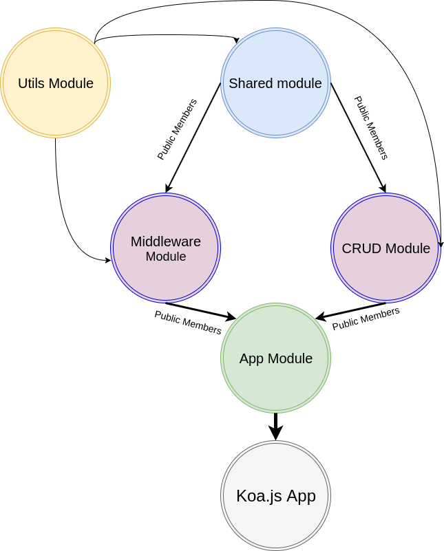

[](https://travis-ci.org/IvanProdaiko94/hekdi)
[]()
[](https://www.npmjs.com/package/hekdi)
[](https://www.npmjs.com/package/hekdi)


# node.js Dependency Injection

### Scale your node.js app with ease.

```bash
npm i hekdi
```



## Basic usage:

```javascript
// imported.module.js
const { createModule } = require('hekdi');

class Dependency1 {
  constructor() {
    this.name = 'Dependency1';
  }
}

class Dependency2 {
  static get $inject() {
    return ['LocalDependency'];
  }

  constructor(d1) {
    this.name = 'Dependency2';
    this.d1 = d1;
  }
}

module.exports = createModule({
  name: 'ImportedModule',
  declarations: [
    { name: 'LocalDependency', strategy: 'singleton', value: Dependency1 },
    { name: 'PublicDependency', strategy: 'service', value: Dependency2 },
    { name: 'Arr', strategy: 'value', value: [1, 2, 3] }
  ],
  exports: ['PublicDependency', 'Arr']
});
```

```javascript
// main.module.js
const { createModule } = require('hekdi');
const importedModule = require('./imported.module');

class Ctrl {
  static get $inject() {
    return ['PublicDependency', 'Arr'];
  }

  constructor(publicDep, arr) {
    console.log(publicDep, arr);
  }
}

module.exports = createModule({
  name: 'SharedModule',
  declarations: [
    { name: 'Controller', strategy: 'singleton', value: Ctrl },
    { name: 'ControllerAs', strategy: 'alias', value: 'Controller' }
  ],
  imports: [ importedModule ]
})
```

```javascript
// app.js
const { DI } = require('hekdi');
const MainModule = require('./main.module');
const di = DI.create();

di.bootstrap(MainModule);

const ctrl = di.resolve('ControllerAs');
// Dependency2 { name: 'Dependency2', d1: Dependency1 { name: 'Dependency1' } } [ 1, 2, 3 ]
```

## Main concepts:

### Top level API:
Top level api is `DI` class that bootstraps main module and serves dependencies from it then.

```javascript
const { DI } = require('hekdi');
const di = DI.create();

di.module(moduleConfig) // creates new module from config

di.bootstrap(moduleConfig) // register module as main one and resolve dependencies from it

const dep = di.resolve('dependency') // return dependency that was registered to bootstrapped module according to its strategy
```

### Modularity:

DI provides modules as a structural unit of app.
- `declarations` array sets own dependencies of this module.
- `exports` array tells what dependencies are available for other modules
- `imports` array will inject exported members from other module to this one

```javascript
const { createModule } = require('hekdi');

createModule({
  name: 'SomeModule',
  declarations: [
    { name: 'LocalDependency', strategy: 'singleton', value: class X {} },
    { name: 'PublicDependency', strategy: 'service', value: class Y {} },
    { name: 'Arr', strategy: 'value', value: [1, 2, 3] }
  ],
  exports: ['PublicDependency', 'Arr'], // if '*' set, module will export all of the dependencies including imported 
  imports: [ AnotherModuleInstance ]
});
// here 'LocalDependency' will be available for injection only for members of this module. 
```

### Strategies:
- `service` - each time a new instance will be created with `new` keyword.
- `factory` - return the result of plain function call.
- `singleton` - only one instance will be created.
- `value` - just will be returned.
- `constant` - the same as `value` but can't be reassign.
- `alias` - used to create an alias for some dependency.

# Koa.js usage:

`hekdi` can be integrated with [koa.js](https://github.com/koajs/koa).

The main concept of framework integration is monkey patching of functions
that are responsible for requests handling.

While using koa hakdi monkey patches `use` method.

#### Basic usage:
```javascript
const Koa = require('koa');
const { koaDI } = require('hekdi');
const app = new Koa();

const moduleToBootstrap = {
  name: 'MainModule',
  declarations: [
    { name: 'ctrl', strategy: 'singleton', value: SomeClass },
    { name: 'echo', 
      strategy: 'value', 
      value: async (ctx) => {
         ctx.body = ctx.request.body;
      }
    }
  ],
  exports: '*'
};

koaDI(moduleToBootstrap, app);
// now di is already bootstrapped and ready to work. 
// In koa app you can reach di as `app.context.di`
// In di you can get koa app as `App` dependency.
app.use({
  controller: 'ctrl', // if dependency is object
  action: 'middleware', // you tell which of its methods will be called
  params: [1, 2, 3] // also you can pass additional params to call if needed
});

app.use({ action: 'echo' }); 
// you can reach some function without class creation by passing only action
// to `use` method

app.use(async (ctx) => { // you still can pass function to `use` method
  ctx.body = ctx.request.body;
});

app.listen(3000)
```

### Usage with router
While using router the story is almost the same:
```javascript 
'use strict';

const Koa = require('koa');
const Router = require('koa-router');
const bodyParser = require('koa-body-parser');
const { koaDI } = require('hekdi');

const app = new Koa();
const router = new Router();

const moduleToBootstrap = {
  name: 'MainModule',
  declarations: [
    { name: 'ctrl', strategy: 'singleton', value: SomeClass },
    { name: 'echo', 
      strategy: 'value', 
      value: async (ctx) => {
         ctx.body = ctx.request.body;
      }
    }
  ],
  exports: '*'
};

koaDI(moduleToBootstrap, app, router);

app.use(bodyParser());

router
  .post(['/', '/test'], { action: 'echo'})
  .get('/', {
    controller: 'ctrl',
    action: 'getHandler',
    params: [1, 2, 3]
  }).get('/test', async (ctx) => {
    ctx.body = 'handled';
  });

  app
    .use(router.routes())
    .use(router.allowedMethods());

  app.listen(3000);
```
